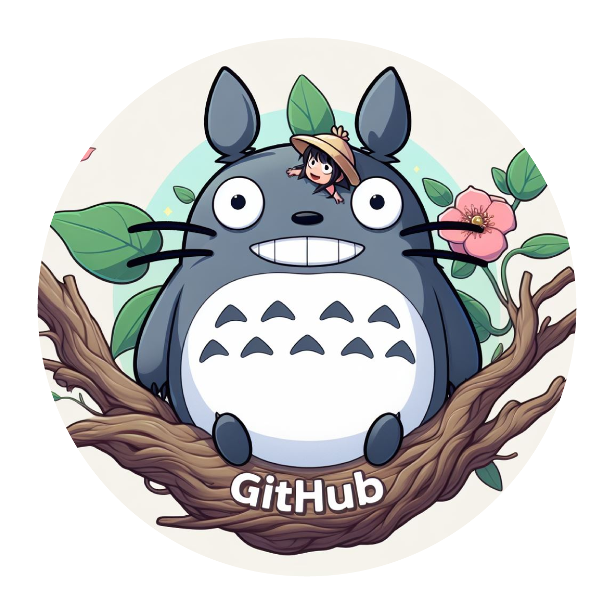
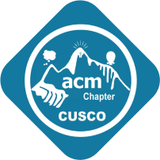

<link rel="stylesheet" href="https://cdnjs.cloudflare.com/ajax/libs/font-awesome/5.15.4/css/all.min.css">

# 
Hi, I'm Gilly Phuu :3 <i class="fas fa-paw" style="color:yellow"></i> 

# <i class="fas fa-graduation-cap" style="color:cyan"></i> About Me:

Computer and systems engineering student, member of ACM.Chapter.Cusco, member of the Angry Penguins, a group focused on Linux.

 

  
  
  
  

## <i class="fas fa-globe" style="color:red"></i> Socials:
<a href="https://facebook.com/glina.01/" style="color:blue"><i class="fab fa-facebook fa-2x"></i></a>
<a href="https://instagram.com/glina_u.u" style="color:#bc2a8d"><i class="fab fa-instagram fa-2x"></i></a>
<a href="https://github.com/gillyphuu" style="color:lime"><i class="fab fa-github-alt fa-2x"></i></a>

### [Rrubber Ducky](https://www.youtube.com/watch?v=efrvvtQzOrk)  <i class="fas fa-robot" style="color:blue"></i>
Rubber Ducky emulation with arduino.

# <i class="fas fa-laptop-code" style="color:lime"></i> Tech Stack:
                               

# <i class="fas fa-trophy" style="color:cyan"></i> GitHub Stats:
 
 

### <i class="fas fa-quote-left" style="color:green"></i> Random Dev Quote

### <i class="fas fa-brain" style="color:cyan"></i> Top Contributed Repo

---

<!-- Proudly created with GPRM ( https://gprm.itsvg.in ) -->
